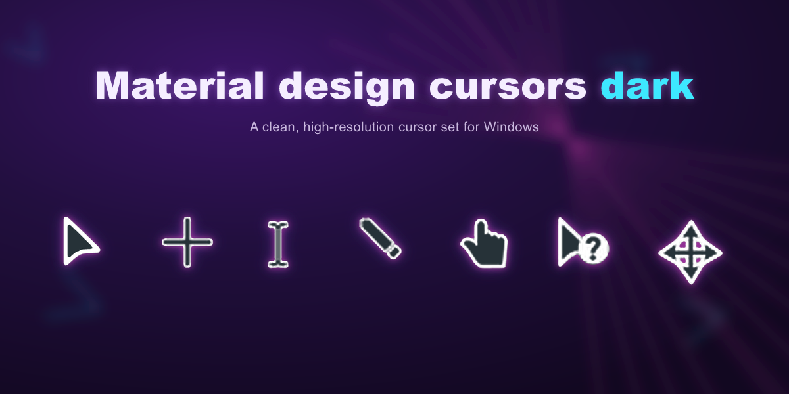
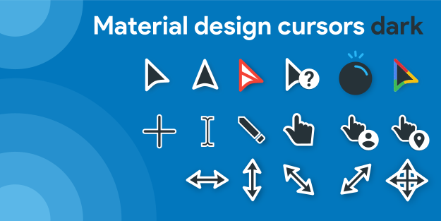

**English** | [中文](https://github.com/WoodPig4869/material-dark-cursors/blob/main/README_ZH.md)

# material-dark-cursors

A dark, Material Design–styled cursor theme for Windows — a high-resolution rework of the original pack by [JepriCreations](https://paypal.me/JeprisCreations), recolored and rebuilt up to 128px with clean, sub-pixel-accurate edges.




## Features

- Dark navy (`#263238`) cursor fills, consistent across every cursor in the set
- Multi-resolution `.cur` / `.ani` files (32 / 48 / 64 / 96 / 128 px) with scaled hotspots
- Sub-pixel edge reconstruction on the pointer cursor for crisp corners at high DPI
- Ready-to-use Windows cursor scheme (`Install.inf`) — installs with one click

## Included cursors

| File | Windows role |
|---|---|
| `pointer.cur` | Normal Select (Arrow) |
| `help.cur` | Help Select |
| `work.ani` | Background Working |
| `busy.ani` | Busy (Wait) |
| `cross.cur` | Precision Select (Crosshair) |
| `text.cur` | Text Select (I-Beam) |
| `handwriting.cur` | Handwriting |
| `unavailiable.cur` | Unavailable (No-Drop) |
| `vert.cur` / `horz.cur` | Vertical / Horizontal Resize |
| `dgn1.cur` / `dgn2.cur` | Diagonal Resize |
| `move.cur` | Move |
| `alternate.cur` | Alternate Select |
| `link.cur` | Link Select (Hand) |
| `account.cur` | Person |
| `place.cur` | Location Select (Pin) |

## Installation (Windows)

1. Download or clone this repository.
2. Right-click `Install.inf` → **Install**.
3. Go to **Settings → Mouse → Additional mouse options → Pointers** tab, and select the scheme **material-dark-cursors**.

The `Person` and `Pin` cursors (`account.cur`, `place.cur`) aren't part of the standard scheme registry key set and must be assigned manually from the same Pointers tab.

## Try it in a browser

`test_cursors.html` is a small bilingual (EN/中文) test page — open it in any browser to hover over a grid of boxes and preview every cursor in this pack side by side with the browser's built-in cursor keywords (pointer, text, grab, wait, …), no installation needed. Note that browsers cap custom CSS cursors at 128×128px and generally don't support `.ani` animated cursors, so `busy`/`work` fall back to their closest CSS keyword there.

## Repository structure

```
Install.inf          Windows cursor-scheme installer
*.cur / *.ani         the cursor files themselves
STYLE_GUIDE.md        notes on the color/edge processing applied to this set
test_cursors.html     bilingual browser test page for all cursors
README.md / README_ZH.md   this file, in English / Chinese
LICENSE                CC BY 4.0
```

## License

Released under [CC BY 4.0](LICENSE) — free to use, modify, and redistribute, even commercially, as long as appropriate credit is given. See [LICENSE](LICENSE) for the full attribution requirement.

## Credits

- Original artwork & concept: **Material Design Cursors** by JepriCreations
- High-resolution rework, recoloring, and packaging: **WoodPig4869**
