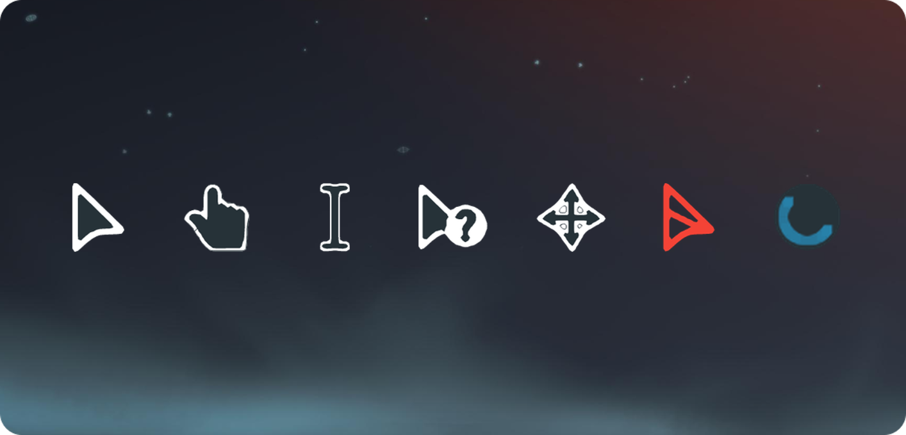

[English](https://github.com/WoodPig4869/material-dark-cursors/blob/main/README.md) | **中文**

# material-dark-cursors

[](LICENSE)
[](#相容性)

一套深色、Material Design 風格的 **Windows 11 滑鼠游標主題／游標包** —— 取代預設的 Windows 指標，基於 [JepriCreations](https://paypal.me/JeprisCreations) 原作重新改色，並重建成高解析、支援 HiDPI/4K 螢幕的 `.cur`/`.ani` 檔案，邊緣經過次像素級處理。



## 特色

- 統一的深藍炭灰色（`#263238`）主體填色，整套游標色調一致
- 內嵌多尺寸 `.cur` / `.ani`（32 / 48 / 64 / 96 / 128 px），熱點座標依比例縮放，HiDPI/4K 螢幕下依然銳利
- pointer 游標採用次像素邊界重建，高 DPI 下尖角依然銳利不糊
- 附完整 Windows 游標配置檔（`Install.inf`），一鍵安裝

## 相容性

Windows 11。採用標準的 `.cur`/`.ani` 游標格式，透過 `Install.inf` 註冊到「`Control Panel\Cursors`」配置方案。

## 游標對照表

| 檔案 | 對應 Windows 功能 |
|---|---|
| `pointer.cur` | 一般選取（箭頭） |
| `help.cur` | 說明選取 |
| `work.ani` | 背景執行中 |
| `busy.ani` | 忙碌（等待） |
| `cross.cur` | 精確選取（十字） |
| `text.cur` | 文字選取（I 型） |
| `handwriting.cur` | 手寫 |
| `unavailiable.cur` | 無法使用（禁止） |
| `vert.cur` / `horz.cur` | 垂直 / 水平調整大小 |
| `dgn1.cur` / `dgn2.cur` | 對角線調整大小 |
| `move.cur` | 移動 |
| `alternate.cur` | 替代選取 |
| `link.cur` | 連結選取（手形） |
| `account.cur` | 個人 |
| `place.cur` | 位置選取（釘選） |

## 安裝方式（Windows）

1. 下載或 clone 這個 repo。
2. 對 `Install.inf` 按右鍵 → **安裝**。
3. 到「**設定 → 滑鼠 → 其他滑鼠選項 → 指標**」分頁，選擇 **material-dark-cursors** 這個配置方案。

`Person`（個人）與 `Pin`（釘選）這兩個游標（`account.cur`、`place.cur`）不在標準配置方案的登錄機碼裡，需要在同一個「指標」分頁手動指定。

## 用瀏覽器快速預覽

`test_cursors.html` 是一個中英雙語的簡易測試頁 —— 用瀏覽器打開後，把滑鼠移到方框上就能逐一預覽這個套件裡的每個游標，並和瀏覽器內建的游標關鍵字（pointer、text、grab、wait…）並排比較，不需要安裝。注意瀏覽器的 CSS 自訂游標上限是 128×128px，且大多不支援 `.ani` 動畫游標，所以 `busy`／`work` 在頁面上會顯示對應的 CSS 關鍵字樣式作為替代。

## 專案結構

```
Install.inf          Windows 游標配置方案安裝檔
*.cur / *.ani         游標檔案本體
STYLE_GUIDE.md        這套素材的顏色/邊緣處理規格說明
test_cursors.html     中英雙語的瀏覽器測試頁
README.md / README_ZH.md   說明文件（英文／中文）
LICENSE                 CC BY 4.0 授權條款
```

## 授權

採用 [CC BY 4.0](LICENSE) 授權 —— 可自由使用、修改、再散布，包含商業用途，唯一條件是需標註出處。完整的標註要求請見 [LICENSE](LICENSE)。

## 出處

- 原始設計與概念：**Material Design Cursors** by JepriCreations
- 高解析重製、改色與封裝：**WoodPig4869**
